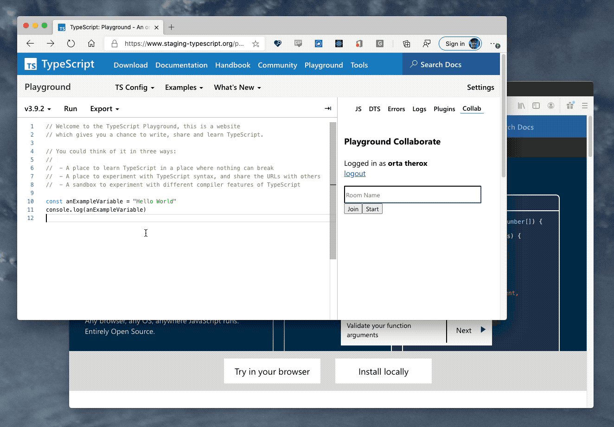

## TypeScript Playground Collaborate

[Like LiveShare](https://visualstudio.microsoft.com/services/live-share/) for the Playground, but no-where near as polished and awesome.

You can create collaboration rooms where one person at a time can edit, and everyone else can use all the Playground inspection tools in read-only mode.



## Running this plugin

- [Click this link](https://www.staging-typescript.org/play?install-plugin=playground-collaborate) to install

or

- Open up the TypeScript Playground
- Go the "Plugins" in the sidebar
- Install through the list

Then it will show up as a tab in the sidebar.

## TODO

- Sync compiler option
- Use SignalR groups properly (today it sends messages to all users, and users filter things which are interesting)
- UI polish
- Safari support seems to be off (access rights/CORs?)

## Contributing

See [CONTRIBUTING.md](./CONTRIBUTING.md) for the full details, however, TLDR:

```sh
git clone https://github.com/orta/playground-collaborate.git
cd playground-collaborate
yarn install
yarn start
```

Then tick the box for starting plugin development inside [the TypeScript Playground](https://www.staging-typescript.org/play).

## Server Stuff

- [SignalR instance](https://ms.portal.azure.com/#@microsoft.onmicrosoft.com/resource/subscriptions/57bfeeed-c34a-4ffd-a06b-ccff27ac91b8/resourceGroups/typescriptlang-org/providers/Microsoft.SignalRService/SignalR/playground-collab/overview)
- [Function App](https://ms.portal.azure.com/#@microsoft.onmicrosoft.com/resource/subscriptions/57bfeeed-c34a-4ffd-a06b-ccff27ac91b8/resourceGroups/playgroundcollab/providers/Microsoft.Web/sites/PlaygroundCollab/appServices)
- [App used in Oauth](https://ms.portal.azure.com/#blade/Microsoft_AAD_RegisteredApps/ApplicationMenuBlade/Overview/appId/f5699f1d-02fe-4a10-8ffc-efd248bf6cce/objectId/df868557-1324-4e30-9303-cee562caa6f7/isMSAApp//defaultBlade/Overview/appSignInAudience/AzureADandPersonalMicrosoftAccount/servicePrincipalCreated/true)
